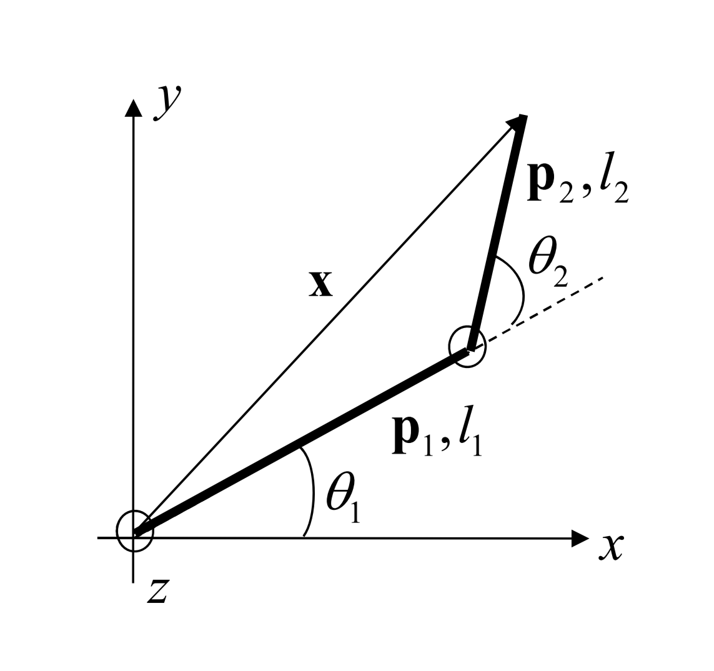

# 💪 Mimicking Robot Arm 🤖

**mimic-arm** is a two-segment planar robot manipulator designed to mimic human arm movements. Its motion is precisely guided using forward kinematics, with joint angles derived from shoulder, elbow, and wrist points detected using **MediaPipe** Pose landmark detection.

## 🎥 Demo

    

> Segment 1 (red) represents the upper arm, and Segment 2 (green) corresponds to the forearm.

## 🚀 Getting started

### Prerequisites

Install the required dependencies

`pip install opencv-python mediapipe numpy Pillow`

### Clone the repository

`git clone https://github.com/krodri95/mimic-arm.git`

### Run

`python main.py path/to/video`

Make sure the video includes your face. I have masked my face in the demo so that the focus is on the arm 😉.

## 🧠 How it Works

### Forward Kinematics of a Two-Segment Planar Robot Manipulator

Determine the position of the end effector based on the lengths of the segments and the angles of the joints.

#### Definitions:

- **l1**: Length of the first segment (upper arm)
- **l2**: Length of the second segment (forearm)
- **θ1**: Angle of the first joint
- **θ2**: Angle of the second joint

#### Equations:

1. Position of the second joint
    - x1 = l1 · cos(θ1)
    - y1 = l1 · sin(θ1)

2. Position of the End Effector
    - x = l1 · cos(θ1) + l2 · cos(θ1 + θ2)
    - y = l1 · sin(θ1) + l2 · sin(θ1 + θ2)

### Methodology

First, the **left shoulder**, **left elbow** and **left wrist** points were converted into vectors. Then, the angles between these vectors were calculated using the dot product, and the direction was determined using the cross product.